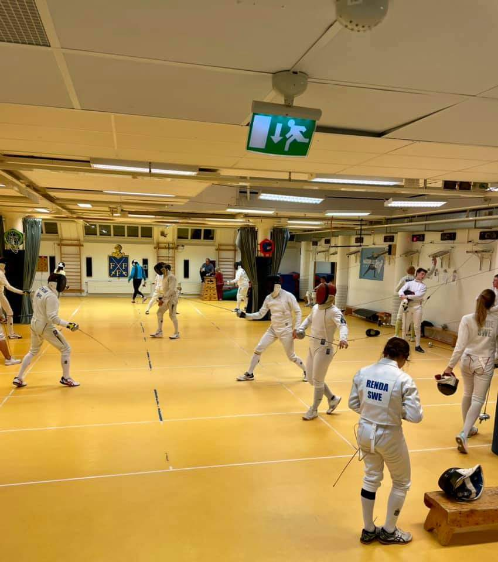

<link href="index_files/lightable/lightable.css" rel="stylesheet" />

Igår torsdags (16 september) var den långa väntan till ända och inte mindre än 17 förväntansfulla fäktare kastade sig med liv och lust in i kampen. Särskilt roligt att notera är att flera av de yngre som Eden, Lukas, Holger, Fancesco och Ian skakat av sig blygseln och tog sig an de gamla rävarna med full glöd.

Ingen kan väl ha undgått Åsas återkomst? Med topplaceringar i de senaste tävlingarna var det självklart att åsynen av Åsa som motståndarefick många nerver att skaka. Och mycket riktigt svepte hon hem en fin 5:e plats.

Många gladde sig också över att återigen få träffa Darius, Fernado och Hugo, som varit borta från FFF en tid. Darius presenterade sig myndigt med en 4:e plats.

När kampen närmade sig slutet drabbade kvällens giganter i form av Tor och Karsten ihop i en holmgång som sent ska glömmas. Karsten tog ett resolut grepp om matchen med en, till synes ointagligt 4-0 ledning. Tor vägrade dock att låta sig avfärdas så lätt och kämpade sig till en kvittering till 4-4. Därefter stod matchen och vägde innan Karsten, efter en dubbelstöt, lyckades avgöra till sin fördel.

Här är den fullständiga resultatlistan.

<table class="table table-striped" style="width: auto !important; ">
 <thead>
  <tr>
   <th style="text-align:left;"> Namn </th>
   <th style="text-align:right;"> Placering </th>
   <th style="text-align:right;"> Poäng </th>
  </tr>
 </thead>
<tbody>
  <tr>
   <td style="text-align:left;"> Karsten Kaping </td>
   <td style="text-align:right;"> 1 </td>
   <td style="text-align:right;"> 25 </td>
  </tr>
  <tr>
   <td style="text-align:left;"> Tor Forsse </td>
   <td style="text-align:right;"> 2 </td>
   <td style="text-align:right;"> 20 </td>
  </tr>
  <tr>
   <td style="text-align:left;"> CH Wendt </td>
   <td style="text-align:right;"> 3 </td>
   <td style="text-align:right;"> 19 </td>
  </tr>
  <tr>
   <td style="text-align:left;"> Darius Lai </td>
   <td style="text-align:right;"> 4 </td>
   <td style="text-align:right;"> 17 </td>
  </tr>
  <tr>
   <td style="text-align:left;"> Åsa Linde </td>
   <td style="text-align:right;"> 5 </td>
   <td style="text-align:right;"> 15 </td>
  </tr>
  <tr>
   <td style="text-align:left;"> Ernest Cimborevic </td>
   <td style="text-align:right;"> 6 </td>
   <td style="text-align:right;"> 13 </td>
  </tr>
  <tr>
   <td style="text-align:left;"> Lukas MC </td>
   <td style="text-align:right;"> 7 </td>
   <td style="text-align:right;"> 12 </td>
  </tr>
  <tr>
   <td style="text-align:left;"> Johan Ström </td>
   <td style="text-align:right;"> 8 </td>
   <td style="text-align:right;"> 11 </td>
  </tr>
  <tr>
   <td style="text-align:left;"> Joakim Ramsberg </td>
   <td style="text-align:right;"> 9 </td>
   <td style="text-align:right;"> 10 </td>
  </tr>
  <tr>
   <td style="text-align:left;"> Janne Tivenius </td>
   <td style="text-align:right;"> 10 </td>
   <td style="text-align:right;"> 9 </td>
  </tr>
  <tr>
   <td style="text-align:left;"> Ian Bäckström </td>
   <td style="text-align:right;"> 11 </td>
   <td style="text-align:right;"> 8 </td>
  </tr>
  <tr>
   <td style="text-align:left;"> Hugo Wik </td>
   <td style="text-align:right;"> 12 </td>
   <td style="text-align:right;"> 7 </td>
  </tr>
  <tr>
   <td style="text-align:left;"> Fernando Bodin </td>
   <td style="text-align:right;"> 13 </td>
   <td style="text-align:right;"> 6 </td>
  </tr>
  <tr>
   <td style="text-align:left;"> Holger Claesson </td>
   <td style="text-align:right;"> 14 </td>
   <td style="text-align:right;"> 5 </td>
  </tr>
  <tr>
   <td style="text-align:left;"> Francesco Pellatta </td>
   <td style="text-align:right;"> 15 </td>
   <td style="text-align:right;"> 4 </td>
  </tr>
  <tr>
   <td style="text-align:left;"> Carl-Johan Wiman </td>
   <td style="text-align:right;"> 16 </td>
   <td style="text-align:right;"> 3 </td>
  </tr>
  <tr>
   <td style="text-align:left;"> Eden Rose Renda </td>
   <td style="text-align:right;"> 17 </td>
   <td style="text-align:right;"> 2 </td>
  </tr>
</tbody>
</table>
