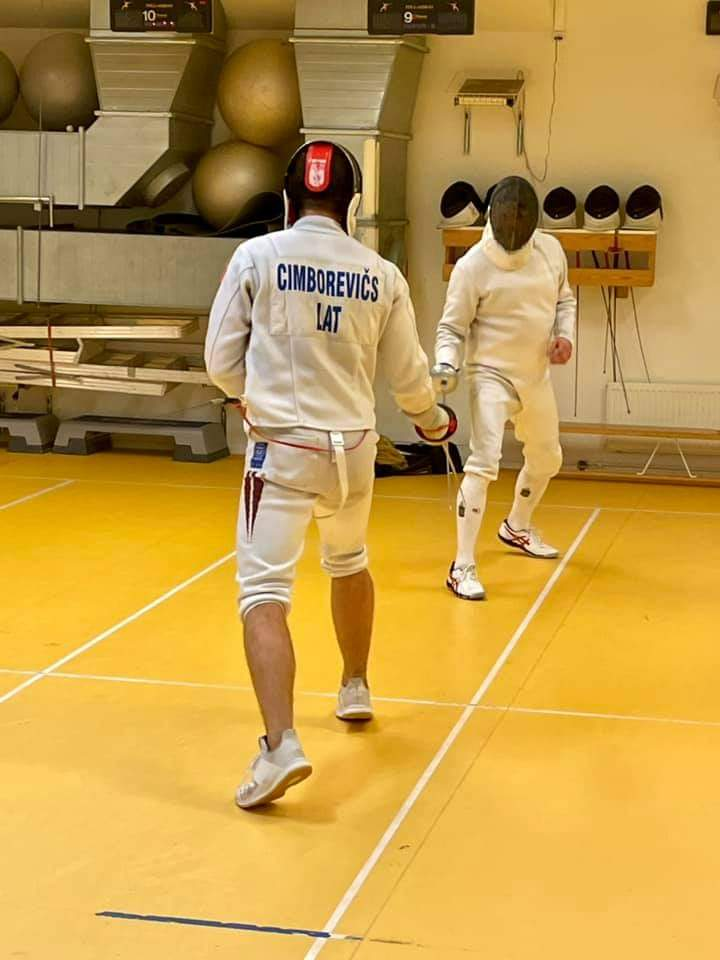

<link href="index_files/lightable/lightable.css" rel="stylesheet" />

<link href="index_files/lightable/lightable.css" rel="stylesheet" />

## En hård kamp mellan 22 fäktare

Ytterligare en tävlingstorsdag och återigen full fart på klubben. Inte mindre än 22 laddade fäktare skrev in sig protokollet! Den här gången var Grigori på plats, vilket han snabbt gjorde alla medvetna om. När kvällen var till ända hade han samlat ihop hela 20 segrar av 21 möjliga. Endast den sluga veteranhjälten CH lyckades stå emot Grigoris framfart.

Tor gjorde åter igen en gedigen insats och tog välförtjänt hem sin andra raka 2:a plats. Men många tyckte att titeln *kvällens fäktare*, trots Grigoris och Tors framfart, mycket väl skulle kunna komma Johan Ström till del. Johans entusiastiska fäktning gav honom hela 16 segrar och en imponerande 3:e placering. Grattis Johan! Ernest fäktade också bra och kunde glädja sig åt en 4:e plats.

Här har ni hela resultatlistan:

<table class="table table-striped" style="width: auto !important; ">
 <thead>
  <tr>
   <th style="text-align:left;"> Namn </th>
   <th style="text-align:right;"> Placering </th>
   <th style="text-align:right;"> Poäng </th>
  </tr>
 </thead>
<tbody>
  <tr>
   <td style="text-align:left;"> Grigori Beskin </td>
   <td style="text-align:right;"> 1 </td>
   <td style="text-align:right;"> 25 </td>
  </tr>
  <tr>
   <td style="text-align:left;"> Tor Forsse </td>
   <td style="text-align:right;"> 2 </td>
   <td style="text-align:right;"> 22 </td>
  </tr>
  <tr>
   <td style="text-align:left;"> Johan Ström </td>
   <td style="text-align:right;"> 3 </td>
   <td style="text-align:right;"> 19 </td>
  </tr>
  <tr>
   <td style="text-align:left;"> Ernests Cimborevic </td>
   <td style="text-align:right;"> 4 </td>
   <td style="text-align:right;"> 17 </td>
  </tr>
  <tr>
   <td style="text-align:left;"> Jan Tivenius </td>
   <td style="text-align:right;"> 5 </td>
   <td style="text-align:right;"> 15 </td>
  </tr>
  <tr>
   <td style="text-align:left;"> Karsten Kaping </td>
   <td style="text-align:right;"> 6 </td>
   <td style="text-align:right;"> 13 </td>
  </tr>
  <tr>
   <td style="text-align:left;"> Joakim Ramsberg </td>
   <td style="text-align:right;"> 7 </td>
   <td style="text-align:right;"> 12 </td>
  </tr>
  <tr>
   <td style="text-align:left;"> Thomas Schiöler </td>
   <td style="text-align:right;"> 8 </td>
   <td style="text-align:right;"> 11 </td>
  </tr>
  <tr>
   <td style="text-align:left;"> C-H Wendt </td>
   <td style="text-align:right;"> 9 </td>
   <td style="text-align:right;"> 10 </td>
  </tr>
  <tr>
   <td style="text-align:left;"> Darius Lai </td>
   <td style="text-align:right;"> 10 </td>
   <td style="text-align:right;"> 9 </td>
  </tr>
  <tr>
   <td style="text-align:left;"> Åsa Linde </td>
   <td style="text-align:right;"> 11 </td>
   <td style="text-align:right;"> 8 </td>
  </tr>
  <tr>
   <td style="text-align:left;"> Ian Bäckström </td>
   <td style="text-align:right;"> 12 </td>
   <td style="text-align:right;"> 7 </td>
  </tr>
  <tr>
   <td style="text-align:left;"> Peter Franzén </td>
   <td style="text-align:right;"> 13 </td>
   <td style="text-align:right;"> 6 </td>
  </tr>
  <tr>
   <td style="text-align:left;"> Fredrik Karlsson </td>
   <td style="text-align:right;"> 14 </td>
   <td style="text-align:right;"> 5 </td>
  </tr>
  <tr>
   <td style="text-align:left;"> Anni Vornanen </td>
   <td style="text-align:right;"> 15 </td>
   <td style="text-align:right;"> 4 </td>
  </tr>
  <tr>
   <td style="text-align:left;"> Olivia Hedberg </td>
   <td style="text-align:right;"> 16 </td>
   <td style="text-align:right;"> 3 </td>
  </tr>
  <tr>
   <td style="text-align:left;"> Hugo Wik </td>
   <td style="text-align:right;"> 17 </td>
   <td style="text-align:right;"> 2 </td>
  </tr>
  <tr>
   <td style="text-align:left;"> Francesco Pelletta </td>
   <td style="text-align:right;"> 19 </td>
   <td style="text-align:right;"> 1 </td>
  </tr>
  <tr>
   <td style="text-align:left;"> Eden Renda </td>
   <td style="text-align:right;"> 20 </td>
   <td style="text-align:right;"> 1 </td>
  </tr>
  <tr>
   <td style="text-align:left;"> Selma Källström </td>
   <td style="text-align:right;"> 18 </td>
   <td style="text-align:right;"> 1 </td>
  </tr>
  <tr>
   <td style="text-align:left;"> Sebastian Holmström </td>
   <td style="text-align:right;"> 21 </td>
   <td style="text-align:right;"> 1 </td>
  </tr>
  <tr>
   <td style="text-align:left;"> Teodor Dahlin </td>
   <td style="text-align:right;"> 22 </td>
   <td style="text-align:right;"> 1 </td>
  </tr>
</tbody>
</table>

Väldigt glädjande att se att allt fler av de unga fäktarna ställer upp. Bra jobbat av Ian, Olivia, Hugo, Francesco, Eden, Selma, Sebastian och Teodor!

## Totalställningen

Låt oss titta på totalställningen:

<table class="table table-striped" style="width: auto !important; ">
 <thead>
  <tr>
   <th style="text-align:right;"> # </th>
   <th style="text-align:left;"> Namn </th>
   <th style="text-align:right;"> 1 </th>
   <th style="text-align:right;"> 2 </th>
   <th style="text-align:right;"> Summa Poäng </th>
  </tr>
 </thead>
<tbody>
  <tr>
   <td style="text-align:right;"> 1 </td>
   <td style="text-align:left;"> Tor Forsse </td>
   <td style="text-align:right;"> 22 </td>
   <td style="text-align:right;"> 22 </td>
   <td style="text-align:right;"> 44 </td>
  </tr>
  <tr>
   <td style="text-align:right;"> 2 </td>
   <td style="text-align:left;"> Karsten Kaping </td>
   <td style="text-align:right;"> 25 </td>
   <td style="text-align:right;"> 13 </td>
   <td style="text-align:right;"> 38 </td>
  </tr>
  <tr>
   <td style="text-align:right;"> 3 </td>
   <td style="text-align:left;"> Ernests Cimborevic </td>
   <td style="text-align:right;"> 13 </td>
   <td style="text-align:right;"> 17 </td>
   <td style="text-align:right;"> 30 </td>
  </tr>
  <tr>
   <td style="text-align:right;"> 3 </td>
   <td style="text-align:left;"> Johan Ström </td>
   <td style="text-align:right;"> 11 </td>
   <td style="text-align:right;"> 19 </td>
   <td style="text-align:right;"> 30 </td>
  </tr>
  <tr>
   <td style="text-align:right;"> 5 </td>
   <td style="text-align:left;"> C-H Wendt </td>
   <td style="text-align:right;"> 19 </td>
   <td style="text-align:right;"> 10 </td>
   <td style="text-align:right;"> 29 </td>
  </tr>
  <tr>
   <td style="text-align:right;"> 6 </td>
   <td style="text-align:left;"> Darius Lai </td>
   <td style="text-align:right;"> 17 </td>
   <td style="text-align:right;"> 9 </td>
   <td style="text-align:right;"> 26 </td>
  </tr>
  <tr>
   <td style="text-align:right;"> 7 </td>
   <td style="text-align:left;"> Grigori Beskin </td>
   <td style="text-align:right;"> NA </td>
   <td style="text-align:right;"> 25 </td>
   <td style="text-align:right;"> 25 </td>
  </tr>
  <tr>
   <td style="text-align:right;"> 8 </td>
   <td style="text-align:left;"> Jan Tivenius </td>
   <td style="text-align:right;"> 9 </td>
   <td style="text-align:right;"> 15 </td>
   <td style="text-align:right;"> 24 </td>
  </tr>
  <tr>
   <td style="text-align:right;"> 9 </td>
   <td style="text-align:left;"> Åsa Linde </td>
   <td style="text-align:right;"> 15 </td>
   <td style="text-align:right;"> 8 </td>
   <td style="text-align:right;"> 23 </td>
  </tr>
  <tr>
   <td style="text-align:right;"> 10 </td>
   <td style="text-align:left;"> Joakim Ramsberg </td>
   <td style="text-align:right;"> 10 </td>
   <td style="text-align:right;"> 12 </td>
   <td style="text-align:right;"> 22 </td>
  </tr>
  <tr>
   <td style="text-align:right;"> 11 </td>
   <td style="text-align:left;"> Ian Bäckström </td>
   <td style="text-align:right;"> 8 </td>
   <td style="text-align:right;"> 7 </td>
   <td style="text-align:right;"> 15 </td>
  </tr>
  <tr>
   <td style="text-align:right;"> 12 </td>
   <td style="text-align:left;"> Lukas MC </td>
   <td style="text-align:right;"> 12 </td>
   <td style="text-align:right;"> NA </td>
   <td style="text-align:right;"> 12 </td>
  </tr>
  <tr>
   <td style="text-align:right;"> 13 </td>
   <td style="text-align:left;"> Thomas Schiöler </td>
   <td style="text-align:right;"> NA </td>
   <td style="text-align:right;"> 11 </td>
   <td style="text-align:right;"> 11 </td>
  </tr>
  <tr>
   <td style="text-align:right;"> 14 </td>
   <td style="text-align:left;"> Hugo Wik </td>
   <td style="text-align:right;"> 7 </td>
   <td style="text-align:right;"> 2 </td>
   <td style="text-align:right;"> 9 </td>
  </tr>
  <tr>
   <td style="text-align:right;"> 15 </td>
   <td style="text-align:left;"> Fernando Bodin </td>
   <td style="text-align:right;"> 6 </td>
   <td style="text-align:right;"> NA </td>
   <td style="text-align:right;"> 6 </td>
  </tr>
  <tr>
   <td style="text-align:right;"> 15 </td>
   <td style="text-align:left;"> Peter Franzén </td>
   <td style="text-align:right;"> NA </td>
   <td style="text-align:right;"> 6 </td>
   <td style="text-align:right;"> 6 </td>
  </tr>
  <tr>
   <td style="text-align:right;"> 17 </td>
   <td style="text-align:left;"> Holger Claesson </td>
   <td style="text-align:right;"> 5 </td>
   <td style="text-align:right;"> NA </td>
   <td style="text-align:right;"> 5 </td>
  </tr>
  <tr>
   <td style="text-align:right;"> 17 </td>
   <td style="text-align:left;"> Francesco Pelletta </td>
   <td style="text-align:right;"> 4 </td>
   <td style="text-align:right;"> 1 </td>
   <td style="text-align:right;"> 5 </td>
  </tr>
  <tr>
   <td style="text-align:right;"> 17 </td>
   <td style="text-align:left;"> Fredrik Karlsson </td>
   <td style="text-align:right;"> NA </td>
   <td style="text-align:right;"> 5 </td>
   <td style="text-align:right;"> 5 </td>
  </tr>
  <tr>
   <td style="text-align:right;"> 20 </td>
   <td style="text-align:left;"> Anni Vornanen </td>
   <td style="text-align:right;"> NA </td>
   <td style="text-align:right;"> 4 </td>
   <td style="text-align:right;"> 4 </td>
  </tr>
  <tr>
   <td style="text-align:right;"> 21 </td>
   <td style="text-align:left;"> Carl-Johan Wiman </td>
   <td style="text-align:right;"> 3 </td>
   <td style="text-align:right;"> NA </td>
   <td style="text-align:right;"> 3 </td>
  </tr>
  <tr>
   <td style="text-align:right;"> 21 </td>
   <td style="text-align:left;"> Eden Renda </td>
   <td style="text-align:right;"> 2 </td>
   <td style="text-align:right;"> 1 </td>
   <td style="text-align:right;"> 3 </td>
  </tr>
  <tr>
   <td style="text-align:right;"> 21 </td>
   <td style="text-align:left;"> Olivia Hedberg </td>
   <td style="text-align:right;"> NA </td>
   <td style="text-align:right;"> 3 </td>
   <td style="text-align:right;"> 3 </td>
  </tr>
  <tr>
   <td style="text-align:right;"> 24 </td>
   <td style="text-align:left;"> Selma Källström </td>
   <td style="text-align:right;"> NA </td>
   <td style="text-align:right;"> 1 </td>
   <td style="text-align:right;"> 1 </td>
  </tr>
  <tr>
   <td style="text-align:right;"> 24 </td>
   <td style="text-align:left;"> Sebastian Holmström </td>
   <td style="text-align:right;"> NA </td>
   <td style="text-align:right;"> 1 </td>
   <td style="text-align:right;"> 1 </td>
  </tr>
  <tr>
   <td style="text-align:right;"> 24 </td>
   <td style="text-align:left;"> Teodor Dahlin </td>
   <td style="text-align:right;"> NA </td>
   <td style="text-align:right;"> 1 </td>
   <td style="text-align:right;"> 1 </td>
  </tr>
</tbody>
</table>

Som så vanligt i KM-sammanhang är Tors namn högst upp på listan, med ett litet avstånd till Karsten. FFF:s sportchefer är inte att leka med! Därefter är det jämt om 3:e platsen som delas av Ernest och Johan S, som båda skuggas av CH.

Åsa gjorde, som vanligt bra ifrån sig och är med på top-10-listan. Hon kommer säkert att fortsätta klättra ännu högre.

> Fortsätt att träna hårt, så ses vi när det drar ihop sig till nästa drabbning den **21 oktober**, då deltävling 3 exploderar!
